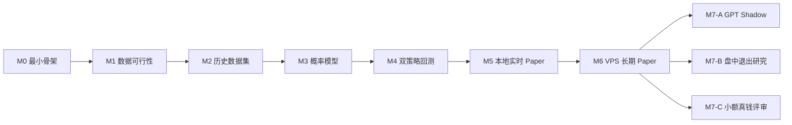

# ProbScout 完整任务分解

> 用途：个人开发执行清单
>
> 配套计划：[DEVELOPMENT_PLAN.md](./DEVELOPMENT_PLAN.md)
>
> 更新规则：开始任务时将 `[ ]` 改为 `[-]`，完成并通过验收后改为 `[x]`。同一时间只保持一个主要任务为 `[-]`。
>
> 文档职责：本文件同时承担个人项目的 Task 目录和动态进度，不再额外维护 Jira、Sprint 或 `PROGRESS.md`。

## 1. 执行原则

- 按直接依赖推进；同一里程碑内没有依赖关系的任务可以按需要调整顺序。
- 未通过当前里程碑 Gate，不启动下一阶段的大规模工作。
- 每个任务以可运行结果或可复核文档结束，不以“写了一部分代码”结束。
- 优先调用成熟开源库；项目只实现领域特有逻辑。
- 任务实际不再需要时直接标记 `Deferred`，不为了完成清单制造无效代码。
- 活动路线为 M0–M6，M7 默认 Deferred；当前只启动 M0，不提前并行模型或交易代码。
- 不因某次回测结果好看而跳过数据质量和实时 Paper。

每个 Task 的完成闭环：

1. 检查直接依赖、范围和禁止事项；
2. 先查官方 SDK 与成熟开源库；
3. 完成最小充分实现，不顺手建设平台能力；
4. 执行该 Task 指定的窄范围验收；
5. 把状态、证据位置和真实限制写回本文件。

完成任务时，在对应 Task 下新增一行 `证据：`，链接测试输出、报告、fixture 或实现文件；尚未执行的任务不预填空白证据项。

Task 标记为 Done 不代表里程碑 Gate 自动通过。Gate 只依据累计数据作出 `Go`、`Conditional Go` 或 `Kill` 判断。

## 2. 状态定义

| 标记 | 状态 | 含义 |
|---|---|---|
| `[ ]` | Todo | 尚未开始 |
| `[-]` | In Progress | 当前正在执行 |
| `[x]` | Done | 已满足验收条件 |
| `[B]` | Blocked | 受外部数据、权限或环境阻塞 |
| `[D]` | Deferred | 当前阶段明确不做 |

## 3. 全局路线与依赖

| 里程碑 | 活动 Task | 通过后得到什么 |
|---|---|---|
| M0 | `PS-001`–`PS-006` | 可运行的最小 Rust 研究骨架 |
| M1 | `DATA-001`–`DATA-010` | Gate 0：数据是否值得继续 |
| M2 | `HIST-001`–`HIST-006` | 可复现且无未来泄漏的数据集 |
| M3 | `MODEL-001`–`MODEL-007` | Gate 1：概率模型是否有信息价值 |
| M4 | `BACK-001`–`BACK-009` | Gate 2：双策略历史证据 |
| M5 | `LIVE-001`–`LIVE-009` | Gate 3：本地实时链路是否可靠 |
| M6 | `OPS-001`–`OPS-005` | Gate 4：长期 Paper 是否支持继续投入 |
| M7 | `ENH-*`、`REAL-*` | 仅按 M6 证据启动的独立增强实验 |

## 4. M0：仓库与最小运行骨架

目标：得到一个能编译、能运行测试、能读取配置、能写 SQLite 的最小 Rust 程序。不要在此阶段实现任何策略。

### [ ] PS-001 补全本地文件忽略规则

- 依赖：无
- 修改：`.gitignore`
- 内容：`.env`、`data/`、SQLite 数据文件、Python cache、虚拟环境、模型 artifact 和本地日志。
- 验收：创建示例本地文件后 `git status --short` 不显示这些文件，源码和 migration 仍能正常显示。

### [ ] PS-002 初始化 Rust 项目

- 依赖：PS-001
- 输出：`Cargo.toml`、`src/main.rs`、`src/lib.rs`
- 要求：单 package、单 binary，不创建 workspace 和多个 service。
- 验收：`cargo check`、`cargo test` 通过；程序能输出版本和帮助信息。

### [ ] PS-003 建立开源依赖清单

- 依赖：PS-002
- 输出：`docs/DEPENDENCIES.md`
- 至少评估：async runtime、HTTP、WebSocket、CLI、config、logging、SQLite、decimal、CSV/Parquet、统计/ML。
- 硬约束：存在满足边界的成熟开源库时必须采用；所有候选均不适配时，先记录证据、最小替代范围并获得用户确认，不得由实现者自行决定重造。
- 验收：每一行包含用途、库、license、选用原因和备选；不固定尚未实际使用的依赖版本。

### [ ] PS-004 接入最小配置和日志

- 依赖：PS-003
- 输出：配置加载和结构化日志。
- 要求：使用开源 config/CLI/logging 库；敏感值只来自环境变量，不打印 secrets。
- 验收：缺失必需配置时返回清晰错误；测试环境可使用临时配置；日志包含时间、level 和任务上下文。

### [ ] PS-005 接入 SQLite 和 migration

- 依赖：PS-003
- 输出：数据库连接、第一份 migration、健康检查命令。
- 要求：使用成熟 Rust SQLite 库及其 migration 能力，不手写连接池和 migration runner。
- 验收：空数据库可以自动升级；重复运行 migration 不破坏数据；最小读写测试通过。

### [ ] PS-006 建立最小质量命令

- 依赖：PS-002
- 输出：README 中的本地验证命令。
- 命令：format check、`cargo check`、窄范围测试。
- 验收：本地一条简短命令或清晰的三条命令即可完成验证；不引入重型 lint 门禁。

### M0 完成检查

- [ ] Rust 程序可以在 Windows 本地编译运行。
- [ ] 配置、日志和 SQLite smoke test 通过。
- [ ] 通用能力均有开源库选择记录。
- [ ] 尚未加入策略、交易和 VPS 代码。

## 5. M1：数据可行性

目标：证明 LOL 比赛、Polymarket 市场和真实订单簿能够可靠获取并匹配。

### [ ] DATA-001 建立轻量 Source Registry

- 依赖：M0 完成检查
- 输出：`docs/DATA_SOURCES.md`
- 数据源：Oracle's Elixir、Leaguepedia、GRID、Polymarket Gamma/CLOB。
- 验收：每个来源记录访问方式、用途、license/terms、研究/真钱限制和审核日期；明确普通 Riot Developer API 不接入。

### [ ] DATA-002 下载 Oracle's Elixir 小样本

- 依赖：DATA-001
- 输出：可重复下载命令、raw 文件 hash、字段摘要。
- 范围：先取一个较小赛季或时间窗口，不下载全部历史。
- 验收：重复下载能识别相同文件；数据保存在 `data/raw/` 且不进入 Git。

### [ ] DATA-003 获取 Leaguepedia 小样本

- 依赖：DATA-001
- 输出：赛程、队伍、赛事和 roster 示例。
- 要求：优先使用公开 API/Cargo 能力，不写 HTML scraper，除非确认无合适接口。
- 验收：至少能查询10场比赛及双方队伍标识，并保留来源时间戳。

### [ ] DATA-004 获取 Polymarket 市场目录

- 依赖：DATA-001
- 输出：LOL event、market、condition ID、token ID 示例。
- 要求：优先使用官方 API 或维护中的开源 client；不逆向网页私有接口。
- 验收：能列出未来和历史 LOL Match Winner 候选，并保存原始响应 fixture。

### [ ] DATA-005 获取 Polymarket 订单簿

- 依赖：DATA-004
- 输出：best bid/ask、depth、tick size、minimum size、fee 信息。
- 验收：对一个开放市场计算10U理论 VWAP；明确 quote 接收时间；fixture 可离线重放。

### [ ] DATA-006 定义统一 Event 和别名

- 依赖：DATA-002、DATA-003、DATA-004
- 输出：最小 `Event`、`TeamAlias`、`MarketMapping` 数据结构。
- 要求：先用直接字段和少量规范化规则，不建立通用实体解析平台。
- 验收：能够解释一条映射使用了哪些来源 ID、队名和时间。

### [ ] DATA-007 实现候选自动匹配

- 依赖：DATA-006
- 输出：候选匹配和置信状态：`Matched`、`NeedsReview`、`Rejected`。
- 验收：时间、队伍双方和系列赛类型矛盾时不得自动匹配；不能确定时进入人工队列。

### [ ] DATA-008 人工核验50场映射

- 依赖：DATA-007
- 输出：50场核验表和错误分类。
- 验收：自动 `Matched` 样本无错误；发现错误必须先修规则，再重新运行完整50场。

### [ ] DATA-009 调查历史市场数据等级

- 依赖：DATA-004、DATA-005
- 输出：Grade A/B/C 覆盖报告。
- 验收：报告明确多少场有 depth、bid/ask、只有 price history；不得把 Grade C 称为可成交回测。

### [ ] DATA-010 作出 Gate 0 决策

- 依赖：DATA-008、DATA-009
- 输出：一页以内结论：Go、Conditional Go 或 Kill。
- 验收：结论引用实际覆盖率、映射错误和历史报价等级，不只写主观判断。

### M1 Gate（Gate 0：数据可行性）

- [ ] 至少50场映射完成复核。
- [ ] 实时订单簿可以稳定读取并离线重放。
- [ ] 历史研究最高能达到的真实性等级已经明确。
- [ ] 数据用途至少允许当前本地研究。

## 6. M2：历史研究数据集

目标：生成不会使用未来信息、能够重复构建的赛前系列赛数据集。

### [ ] HIST-001 定义 raw/processed/artifact 目录

- 依赖：M1 Gate（Gate 0）
- 输出：数据目录和 manifest 格式。
- 验收：每个 processed dataset 能追溯 raw 文件 hash、生成时间和代码版本。

### [ ] HIST-002 统一队伍和赛事身份

- 依赖：HIST-001、DATA-006
- 输出：队伍别名、改名和赛事映射表。
- 验收：同一时期同一队伍不会因名称变体拆成多个实体；无法确认的记录不静默合并。

### [ ] HIST-003 生成系列赛结果数据集

- 依赖：HIST-002
- 输出：每行一场 series 的赛前记录和最终结果。
- 验收：BO3/BO5、赛区、Patch、时间、双方和胜者字段完整；重复事件有确定性处理规则。

### [ ] HIST-004 生成赛前特征快照

- 依赖：HIST-003
- 输出：只使用比赛开始前数据计算的基础特征。
- 验收：每个特征有来源时间；测试能够证明赛后记录不会影响早期比赛特征。

### [ ] HIST-005 按时间划分数据

- 依赖：HIST-004
- 输出：train、validation、calibration、final test manifest。
- 验收：时间区间不重叠；同一系列赛不跨集合；final test 在调参期间不可使用。

### [ ] HIST-006 输出数据质量报告

- 依赖：HIST-005
- 输出：缺失率、覆盖年份、赛区、Patch 和异常值摘要。
- 验收：每个缺失关键字段都有排除或降级规则；报告能重复生成。

### M2 完成检查（历史数据就绪）

- [ ] 至少500场 eligible series，或明确记录不足原因。
- [ ] 时间防泄漏测试通过。
- [ ] 数据集可由脚本从 raw 数据重复生成。

## 7. M3：概率模型

目标：先证明模型概率有信息价值，再谈策略收益。

### [ ] MODEL-001 实现 Constant Baseline

- 依赖：M2 完成检查
- 输出：50%或训练期总体基准概率。
- 验收：final test 指标可计算。

### [ ] MODEL-002 实现 Elo Baseline

- 依赖：MODEL-001
- 输出：按比赛时间顺序更新的 Elo 概率。
- 验收：某场比赛只能使用之前比赛更新的 rating；单元测试覆盖首次参赛和跨赛区场景。

### [ ] MODEL-003 实现 Market Baseline

- 依赖：DATA-009、MODEL-001
- 输出：同一信息时点的市场概率基准。
- 验收：明确概率口径与交易 ask 口径不同；无可靠市场价格时不伪造基准。

### [ ] MODEL-004 训练第一版统计模型

- 依赖：MODEL-002、HIST-005
- 输出：一个简单可解释模型。
- 要求：优先使用成熟开源 ML 库；不自行实现优化器和通用算法。
- 验收：训练流程固定随机种子和 artifact metadata；validation 结果可重复。

### [ ] MODEL-005 概率校准

- 依赖：MODEL-004
- 输出：raw probability、calibrated probability 和 calibration artifact。
- 要求：使用开源校准实现；不得在 final test 拟合。
- 验收：校准前后 Brier、Log Loss 和 calibration curve 可比较。

### [ ] MODEL-006 Walk-forward 评估

- 依赖：MODEL-005
- 输出：按时间窗口的模型与基准比较。
- 验收：报告包含整体、时间、赛区和赛制分段；不只展示最好窗口。

### [ ] MODEL-007 作出 Gate 1 决策

- 依赖：MODEL-006
- 输出：模型继续、回退或停止结论。
- 验收：final test 只运行一次主评估；后续模型修改必须产生新版本并保留旧结果。

### M3 Gate（Gate 1：概率模型）

- [ ] 模型不能在多个时间窗口稳定劣于 Elo Baseline。
- [ ] 概率校准没有明显系统性过度自信。
- [ ] 所有结果可由固定命令重复生成。

## 8. M4：历史双策略回测

目标：在证据允许的真实性等级下比较 Threshold Strategy 与 Edge Strategy。

### [ ] BACK-001 定义不可变策略配置

- 依赖：M3 Gate（Gate 1）
- 输出：Threshold、min probability、min edge、uncertainty buffer、stake 和退出规则配置。
- 验收：配置生成 hash；回测结果记录对应 hash。

### [ ] BACK-002 实现 Threshold Strategy

- 依赖：BACK-001
- 输出：纯函数式入场判断。
- 验收：概率刚好等于、略低和略高阈值的边界测试通过。

### [ ] BACK-003 实现 Edge Strategy

- 依赖：BACK-001
- 输出：使用 conservative probability 和 effective entry price 的判断。
- 验收：fee、slippage、uncertainty buffer 能正确降低 Edge；边界测试通过。

### [ ] BACK-004 实现10U Paper Fill

- 依赖：DATA-005、BACK-002、BACK-003
- 输出：遍历 ask depth 的 VWAP、shares、fee、cash debit 和拒绝原因。
- 要求：优先使用开源 decimal 库；只自行实现 ProbScout 的成交业务规则。
- 验收：多档、部分成交、无流动性、最小订单和 rounding fixtures 全部通过。

### [ ] BACK-005 实现双策略独立账本

- 依赖：PS-005、BACK-004
- 输出：两个500U Paper Account。
- 验收：同一比赛两个策略可以独立交易；任一策略结果不会修改另一策略余额。

### [ ] BACK-006 实现结算

- 依赖：BACK-005
- 输出：win、loss、void/cancel、异常待人工处理。
- 验收：重复执行不会重复入账；结算依据保存的市场规则和最终状态。

### [ ] BACK-007 实现指标报告

- 依赖：BACK-006
- 输出：PnL、ROI、Win Rate、Max Drawdown、Opportunity、Fill Rate 和 Edge buckets。
- 要求：优先使用开源统计和绘图库；先输出 CSV/Markdown，不开发 Web UI。
- 验收：指标有小型人工算例对照；报告同时显示亏损和拒绝交易。

### [ ] BACK-008 执行压力测试

- 依赖：BACK-007
- 输出：基准、额外 slippage、失败成交和 fee 场景。
- 验收：结果按 Grade A/B/C 标记；Grade C 不声称历史 PnL 可成交。

### [ ] BACK-009 作出 Gate 2 决策

- 依赖：BACK-008
- 输出：继续实时 Paper、继续收集数据或 Kill。
- 验收：结论明确哪个策略更优、置信度和主要反例；不因结果不好而临时修改阈值。

### M4 Gate（Gate 2：历史双策略）

- [ ] 双策略使用完全相同的 Prediction 和 Quote 时点。
- [ ] 账本、成交和指标人工算例一致。
- [ ] 历史结果证据等级表述准确。

## 9. M5：本地实时 Paper MVP

目标：在本地跑通真实时间链路。前100–200笔主要验证系统，不证明盈利。

### [ ] LIVE-001 自动发现目标市场

- 依赖：M4 Gate（Gate 2）
- 输出：去重后的 LOL Series Winner 市场目录。
- 验收：只接收 LOL Series Winner；重复发现不会重复创建 event。

### [ ] LIVE-002 维护赛事时间和状态

- 依赖：LIVE-001
- 输出：带原始计划、最新计划和实际开赛时间的赛事状态。
- 验收：保存原始、最新和实际开赛时间；延期和取消不会触发错误交易。

### [ ] LIVE-003 执行 T-15m 快照

- 依赖：LIVE-002、MODEL-005
- 输出：不可变 Feature Snapshot 与 Prediction。
- 验收：每场只生成一个主 Prediction；服务重启不会重复生成。

### [ ] LIVE-004 捕获真实 Market Quote

- 依赖：LIVE-003、DATA-005
- 输出：带接收时间的真实 order book snapshot。
- 验收：保存完整 depth、fee 和时间；quote 过期时拒绝交易。

### [ ] LIVE-005 运行双策略 Paper 决策

- 依赖：LIVE-004、BACK-005
- 输出：两个策略各自的 TradeIntent、拒绝原因与 Paper fill。
- 验收：生成 TradeIntent、拒绝原因和 Paper fill；不调用真钱下单接口。

### [ ] LIVE-006 自动结算和恢复

- 依赖：LIVE-005、BACK-006
- 输出：幂等结算任务、恢复流程和人工异常队列。
- 验收：断线、重启和重复事件后账本仍一致；异常结算进入人工队列。

### [ ] LIVE-007 生成个人日报

- 依赖：LIVE-006
- 输出：一份 Markdown 或终端报告。
- 验收：显示比赛、预测、报价、策略决策、余额、待结算和错误；不开发 Dashboard。

### [ ] LIVE-008 人工复核前20–30笔

- 依赖：LIVE-007
- 输出：逐笔核对表。
- 验收：预测时点、ask/depth、fee、策略决策和结算全部可追溯；差异修复后重新核验。

### [ ] LIVE-009 本地连续运行14天

- 依赖：LIVE-008
- 输出：14天运行记录与完整性摘要。
- 验收：关键任务成功率、重复交易数、缺失 quote、异常结算和重启恢复有明确统计。

### M5 Gate（Gate 3：本地实时链路）

- [ ] 链路连续运行14天。
- [ ] 重复交易和重复结算为0。
- [ ] 前20–30笔人工复核通过。
- [ ] 达到100–200笔前不购买 VPS 也不投入真钱。

## 10. M6：长期 VPS Paper

目标：只有本地链路稳定后才支付服务器成本。

### [ ] OPS-001 准备最小部署

- 依赖：M5 Gate（Gate 3）
- 输出：2 vCPU、2 GB RAM、30–40 GB SSD 的 Ubuntu LTS 部署说明。
- 验收：单 systemd service 能启动、停止和自动恢复；不引入 Docker 编排或 Kubernetes，除非出现明确需求。

### [ ] OPS-002 数据备份和恢复

- 依赖：OPS-001
- 输出：备份命令、保留规则和恢复说明。
- 验收：SQLite、配置和模型 artifact 可以从备份恢复；至少完成一次恢复演练。

### [ ] OPS-003 最小告警

- 依赖：OPS-001
- 输出：面向个人维护者的最小异常通知。
- 验收：进程退出、磁盘不足、连续采集失败和待结算异常能够通知个人维护者；不搭建企业监控平台。

### [ ] OPS-004 累积300–500笔 Paper

- 依赖：OPS-002、OPS-003
- 输出：冻结口径的长期 Paper 数据集与每周报告。
- 验收：持续1–3个月，记录停机和漏采窗口；不将漏采比赛补成虚构实时交易。

### [ ] OPS-005 作出 Gate 4 决策

- 依赖：OPS-004
- 输出：继续 Paper、研究增强、进入小额真钱评审或 Kill。
- 验收：使用净 ROI、置信区间、Max Drawdown、稳定性和执行偏差作决定。

### M6 Gate（Gate 4：长期 Paper）

- [ ] 累积300–500笔真实时间 Paper fills，或按观察方差给出继续采样理由。
- [ ] 历史与实时表现差异已解释。
- [ ] 报告同时包含净 ROI、置信区间、Max Drawdown、校准和运行缺口。
- [ ] 已明确决定继续 Paper、启动某个 M7 子任务或 Kill。

## 11. M7：条件性增强任务

以下任务默认 Deferred，只有前置 Gate 提供证据后才启动。

### [D] ENH-001 GPT Shadow Enhancement

- 前置：长期 Paper 模型稳定，且非结构化信息缺失被证明是主要误差来源。
- 输出：结构化事件抽取器、Shadow Prediction 和增量评估报告。
- 验收：GPT 只提取结构化事件；Shadow 模型 OOS 指标改善后才影响 Prediction。

### [D] ENH-002 Intermap 数据研究

- 前置：获得明确授权的实时 telemetry。
- 输出：独立的系列赛中条件概率数据集与模型。
- 验收：单独训练系列赛条件胜率模型，不复用赛前模型冒充盘中模型。

### [D] ENH-003 动态退出策略

- 前置：ENH-002 通过。
- 输出：三种 Exit Policy 的独立 Paper 账本和比较报告。
- 验收：独立比较 HoldToResolution、机械止损和 RevalueAndExit，不回写第一阶段结果。

### [D] REAL-001 小额真钱安全评审

- 前置：300–500笔以上长期 Paper、数据授权、账户和所在地资格全部明确。
- 输出：权限、钱包、执行、熔断、对账和资金边界评审结论。
- 验收：独立评审钱包、下单、熔断、对账和资金上限；未通过不得注入私钥。

### [D] REAL-002 300–500U 小额试验

- 前置：REAL-001 通过。
- 输出：真钱与 Shadow Paper 对账报告。
- 验收：只运行一个胜出策略，单笔约3–5U且不超过权益1%；另一策略保持 Shadow Paper。

## 12. Open Source First 检查表

每个涉及通用能力的任务完成前检查：

- [ ] 已查官方 SDK 或官方推荐实现。
- [ ] 已查 crates.io/PyPI/GitHub 的维护中项目。
- [ ] 已检查 license 和基本维护状态。
- [ ] 已检查默认 timeout、retry、遥测、分页和数据外发行为。
- [ ] 没有复制无 license 的代码。
- [ ] 没有手写 HTTP、WebSocket、SQLite、Decimal、CLI、日志、重试或常见 ML 算法。
- [ ] 新增依赖已写入 `docs/DEPENDENCIES.md`。
- [ ] 自研代码确实属于 ProbScout 领域逻辑；若没有合适库，已记录候选缺口并获得用户确认。
- [ ] 没有为了测试方便创建多层无业务价值的 wrapper。

## 13. 当前下一步

只执行以下三个任务，不并行展开模型和交易代码：

1. `PS-001`：补全 `.gitignore`。
2. `PS-002`：初始化最小 Rust 项目。
3. `PS-003`：评估并记录第一批开源依赖。

完成 M0 检查后，再开始 `DATA-001`。这能确保项目以最小骨架启动，同时从第一行代码起遵守 Open Source First。
